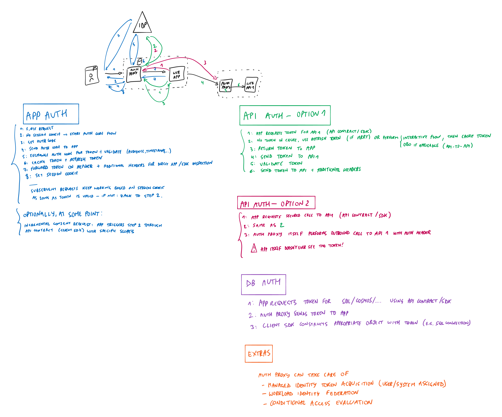

# Auth Proxy

This project intends to remove identity complexity from application developers as much as possible, and instead deal with authentication flows, HTTP redirects, authentication cookies, token acquisition and caching, etc. in a completely separate process which sits in front of the app as a reverse proxy. This allows the application to offload complexity to an independent layer which embodies best practices and can be updated as identity standards and patterns evolve. The application itself then only needs to work through very simple native HTTP constructs (where possible) or HTTP API's (where necessary) to receive and request identity-related information.

## Functionality

The reverse proxy should be able to:

- Take care of all redirects towards the IdP when authentication is required, and the responses coming back.
- Pass through relevant identity information to the application without exposing full details from the IdP (unless absolutely necessary), for example only pass a specific set of claims to the app as a JWT token or via HTTP headers.
- Maintain session state for each user (i.e. issue and verify the session cookie).
- Acquire tokens (id tokens, access tokens, refresh tokens) from the IdP and cache them securely and appropriately.
- Support multiple authentication and authorization protocols (OpenID Connect, OAuth 2.0, SAML 2.0, WS-Federation).
- Allow the app to request calls to other API's to be performed by the proxy so that the app doesn't even have to get access to the tokens (the reverse proxy requests them as needed and attaches them to the outbound call to the external API). This improves security dramatically in a Zero Trust context, as the app never sees the token.
- Allow the app to request tokens to call other API's or use in the app itself (when it cannot be avoided, for example to attach tokens to SQL connections or SDK's used in the app).
- Support multiple IdP's for a single application (although for more advanced cases a "federation broker" IdP such as Auth0 or Azure AD B2C may be more suitable).
- Expose value-added functionality that is IdP-specific, for example:
  - Support [incremental or dynamic consent when using the Microsoft identity platform](https://docs.microsoft.com/azure/active-directory/develop/v2-permissions-and-consent#incremental-and-dynamic-user-consent).
  - Support workload identity federation as implemented by [Azure AD](https://docs.microsoft.com/azure/active-directory/develop/workload-identity-federation) or [Google](https://cloud.google.com/iam/docs/workload-identity-federation).
  - Support [conditional access evaluation in Azure AD](https://docs.microsoft.com/azure/active-directory/conditional-access/concept-continuous-access-evaluation).
  - Acquire tokens for [managed identities for Azure resources](https://docs.microsoft.com/azure/active-directory/managed-identities-azure-resources/overview)
  - Work with [user flows or custom policies in Azure AD B2C](https://docs.microsoft.com/azure/active-directory-b2c/user-flow-overview).
  - Work with [Auth0 Organizations](https://auth0.com/docs/manage-users/organizations).
  - ...

The proxy should never host a User Interface, i.e. it should not generate HTML and only work with the IdP and app but not "present itself" to the end user.

The proxy interacts with the application only through a stable HTTP based "contract". For example, the app generally shouldn't care if the user just authenticated directly from the IdP, or if authentication was performed through a session cookie for a subsequent call. The app should expect to see the same relevant information passed in for each call.

On top of that, to make it easier to build apps using the reverse proxy, a client SDK for all major runtimes/languages (.NET, Java, Python, Go, ...) could be convenient to:

- Populate the current user / identity / claims principal in the application with the information coming from the proxy.
- Request information from the proxy (e.g. to acquire a token, or perform an outbound call for which the proxy attaches the token).
- Auto-wire certain common functionality with identity based information; for example: set the appropriate [SqlConnection.AccessToken](https://docs.microsoft.com/dotnet/api/system.data.sqlclient.sqlconnection.accesstoken?view=dotnet-plat-ext-6.0) property for .NET scenarios.

## Deployment

The proxy can be deployed in many ways for maximum flexibility:

- As a self-hosted application (i.e. build and run the proxy however you want).
- As a prebuilt container (likely as a reverse proxy sidecar container next to the app, for example as a service mesh in Kubernetes).
- As built-in functionality of hosting platforms (for example, ideally it could replace the proprietary [Azure App Service "Easy Auth"](https://docs.microsoft.com/azure/app-service/overview-authentication-authorization) functionality as a fully managed offering by hosting this open source project directly in front of customer apps).
- Ideally at some point as a [Dapr](https://dapr.io/) component or middleware.
- Possibly even in-process; however then you would lose the benefit of the decoupled lifecycle from the app (for example, for independent updates).
- ...

## Configuration

Because you should be able to host the proxy in a variety of ways, its implementation should be considered a black box which is driven purely from configuration. For example, the available IdPs, anonymous versus authenticated paths, external APIs, scopes, ... The proxy should be *insanely configurable*.

Configuration could be provided as environment variables, configuration files, an external configuration API endpoint (which is called at startup), ...

## Claims Transformation

### Default Behavior

Auth Proxy uses incoming claims from the IdPs to generate the appropriate information that will be sent to the backend app.

- For OpenId Connect: uses the claims of the `id_token` (*not* an `access_token` as this is opaque to the client and shouldn't carry *authentication* information).
- For SAML 2.0 protocol and WS-Federation: uses the assertions in the SAML token.
- For JWT bearer authorization: uses the claims from the incoming bearer token (typically an OAuth 2.0 `access_token` intended for this relying party).

At a minimum, the proxy should create an identifier that the backend app can rely on for uniquely identifying the user, typically by combining a unique user value within the IdP with a unique identifier of the IdP itself. For example, in the case of OpenID Connect the user is identified using the standard `sub` (subject) claim, and the IdP using the standard `iss` (issuer) claim; these are combined into `sub + '@' + iss` and sent to the backend app.

### Claims Transformation Expressions

#### Syntax

The claims that are sent to the backend app are pre-configured for each IdP type but can be fully customized via claims transformation expressions.

Each expression returns an output claim based on a transformation expression:

`output=<transformation>`

As a shorthand to return the same output claim as an input claim, you can specify just the name of that claim. For example, adding an expression `email` will send the original `email` value(s) of the IdP to the backend app.

An *empty* `<transformation>` means that no output will be returned; this can be useful when you want to remove an output claim that was generated by default. For example, adding an expression `iss=` (note the `=` sign at the end to differentiate it from the shorthand syntax explained above) ensures that no `iss` claim will be sent to the backend app.

#### Inputs

The following inputs can be used in transformations:

- [X] `string['value']` or simply `'value'`: returns a constant string value.
- [X] `claim[type]` or simply `type`: returns incoming claim values for the specified claim `type`.
- [ ] `config[name]`: returns a configuration value.
- [ ] `idp[name]`: returns information about the IdP that authenticated the user.

The following `config` names are available:

- [ ] `config[issuer]`: the configured `issuer` value used by the proxy.
- [ ] `config[audience]`: the configured `audience` value that represents the backend app.
- [ ] ...

The following `idp` names are available:

- [ ] `idp[name]`: the `name` of the IdP that authenticated the user.
- [ ] `idp[type]`: the `type` of the IdP that authenticated the user.
- [ ] ...

Note that if there are multiple claim values for a claim type in the expression, or even multiple claim types in the expression which each have multiple claim values, the output claim will have values for the Cartesian product of all input claim values.

#### Functions

- [X] `+`: concatenates strings.
- [ ] `split(input, separator)`: splits the `input` claim value(s) into multiple values based on the specified `separator` string.
- [ ] `join(input, separator)`: returns one claim value with the concatenated values of all original `input` claim values, joined with the specified `separator` string.

#### Examples

Given the following input claims (in JSON format):

```json
{
  "sub": "user123",
  "iss": "https://example.org",
  "scp": "openid profile email",
  "roles": [ "reader", "writer" ]
}
```

The following example expressions can be constructed:

| Expression                                   | Output (in JSON format)                                                                                                        | Explanation                                                                         |
| -------------------------------------------- | ------------------------------------------------------------------------------------------------------------------------------ | ----------------------------------------------------------------------------------- |
| `sub`                                        | `{ "sub": "user123" }`                                                                                                         | Returns the original `sub` claim value (shorthand syntax for the entire expression) |
| `sub=sub`                                    | `{ "sub": "user123" }`                                                                                                         | Returns the original `sub` claim value (shorthand syntax for the claim type)        |
| `sub=claim[sub]`                             | `{ "sub": "user123" }`                                                                                                         | Returns the original `sub` claim value (full syntax)                                |
| `roles`                                      | `{ "roles": [ "reader", "writer" ] }`                                                                                          | Returns all the original `roles` claim values                                       |
| `sub=`                                       | (None)                                                                                                                         | Removes the `sub` claim value so it won't be sent to the backend app                |
| `ver='1.0'`                                  | `{ "ver": "1.0" }`                                                                                                             | Returns a `ver` claim with a constant value (shorthand syntax for the string value) |
| `ver=string['1.0']`                          | `{ "ver": "1.0" }`                                                                                                             | Returns a `ver` claim with a constant value                                         |
| `sub=sub + '@' + iss`                        | `{ "sub": "user123@https://example.org" }`                                                                                     | Concatenates the original `sub` claim with an `@` character and the `iss` claim     |
| `scp=split(scp, ' ')`                        | `{ "scp": [ "openid", "profile", "email" ] }`                                                                                  | Splits values of the `scp` claim by a space into multiple `scp` claims              |
| `roles=join(roles, ' ')`                     | `{ "roles": "reader writer" }`                                                                                                 | Joins multiple  `roles` claims into a single `roles` value separated by a space     |
| `idp=idp[name]`                              | `{ "idp": "example.org" }`                                                                                                     | Returns the name of the IdP that authenticated the user as the `idp-name` claim     |
| `scopes-roles=split(scp, ' ') + '-' + roles` | `{ "scopes-roles": [ "openid-reader", "openid-writer", "profile-reader", "profile-writer", "email-reader", "email-writer" ] }` | Returns the Cartesian product of all the (split) scopes and roles                   |

## Security

Communication between the proxy and the backend app can be secured.

- Outbound security (proxy to app)
  - Options:
    - Client Certificate
- Inbound security (app to proxy)
  - The proxy's API should be opt-in enabled i.e. only expose the API if required by the API
  - Options:
    - None (discouraged, only if sufficient transport-level security can be enforced such as network ACLs)
    - Basic authentication
    - Fixed API key
    - Client Certificate
    - Authentication token: a round-tripped opaque token which the proxy sends on each outbound call to the app as an HTTP header (which can rotate each call or be cryptographically secured); the app simply forwards that on the call to the API to prove its identity; possibly this token also contains the unique user ID as known in proxy so it doesn't need additional parameters to identify the user

## Dynamic Actions

Some decisions aren't static or configuration-driven, for example to trigger authentication or MFA based on business logic. The app can then instruct the proxy to perform certain functionality, for example by returning well-defined HTTP headers to trigger an authentication challenge:

- `X-Auth-Action: challenge`
- `X-Auth-ReturnUrl: /foo/bar`

The proxy will see these headers coming back on the HTTP response and take appropriate action, for example by building the redirect URL for the IdP in this case and returning that as the HTTP response instead.

Again, this can be made easier for app developers by using the client SDK for their given runtime/language.

## Whiteboard



## Notes

- App Service Easy Auth is the closest we have to a realization of the idea today at Microsoft, but locked to App Service.
  - See [Configuration File Reference](https://docs.microsoft.com/azure/app-service/configure-authentication-file-based#configuration-file-reference) for relevant ideas.
- The Azure API Management Token Store also aims for a related mission.
- There are somewhat similar implementations but they don't go as deep and they're a part of other stacks, for example [Ambassador Edge Stack](https://www.getambassador.io/docs/edge-stack/latest/howtos/oauth-oidc-auth/).
- This should be provided out of the box in Dapr
  - [Dapr middleware](https://docs.dapr.io/reference/components-reference/supported-middleware/) has some of this functionality (but built-in to the Dapr sidecar itself and not externalized/pluggable as another sidecar?)
    - [OAuth2](https://github.com/dapr/components-contrib/blob/master/middleware/http/oauth2/oauth2_middleware.go) supports authorization code exchange and then puts the acquired token on the call to the actual Dapr service.
      - However, it doesn't perform token caching, inspection/validation of the token (audience, timestamps, ...), etc.
    - [OAuth2 Client Credentials](https://github.com/dapr/components-contrib/blob/master/middleware/http/oauth2clientcredentials/oauth2clientcredentials_middleware.go) supports token caching, but only works with client secret (no certificate or managed identity or other authentication mechanism).
    - [Bearer](https://github.com/dapr/components-contrib/blob/master/middleware/http/bearer/bearer_middleware.go) "validates" tokens but performs only very limited validation against OpenID Connect metadata (which doesn't seem cached either, which could be a performance hit).
- Actual token cache / store could be "API Hub" which is used by APIM Token Store and Logic Apps for example
